# N8N File Integration Architecture - Hybrid Approach

This document outlines two approaches for N8N file integration, with a hybrid implementation strategy for rapid MVP development and production security.

## Implementation Strategy

### Phase 1: MVP - Direct File Retrieval
**Goal**: Get MVP working quickly with minimal complexity
**Security**: Development/internal use acceptable
**Timeline**: Immediate implementation

### Phase 2: Production - Signed URLs  
**Goal**: Production-ready security for customer-facing SaaS
**Security**: Zero-trust, time-limited access
**Timeline**: Post-MVP, before customer deployment

## Approach 1: Direct File Retrieval (MVP Implementation)

### Architecture Overview


```mermaid
graph TD
    A["👤 User Uploads Files"] --> B["📁 Supabase Storage<br/>invoice-reconciler bucket"]
    B --> C["📦 Create Webhook Payload<br/>with file paths"]
    C --> D["🚀 Send Webhook to N8N<br/>(paths + metadata)"]
    
    D --> E["📥 N8N Supabase Node<br/>Downloads files directly"]
    E --> F["⚙️ N8N Code Node<br/>Processes files"]
    F --> G["📊 Generate Report"]
    G --> H["📤 Upload Result to<br/>reconciler-reports bucket"]
    H --> I["🔄 Send Callback to App<br/>with result URL"]
    
    I --> J["✅ User Downloads Report<br/>(48 hour expiry)"]
    
    style A fill:#e1f5fe
    style B fill:#f3e5f5
    style C fill:#e8f5e8
    style D fill:#ffebee
    style E fill:#e3f2fd
    style F fill:#f1f8e9
    style G fill:#fce4ec
    style H fill:#e0f2f1
    style I fill:#fff8e1
    style J fill:#e8eaf6
```

### Webhook Payload (Direct Retrieval)
```json
{
  "job_id": "123e4567-e89b-12d3-a456-426614174000",
  "user_id": "user-uuid",
  "airline_type": "fly-dubai",
  "files": {
    "invoice": {
      "path": "user_id/jobs/job_id/invoice.pdf",
      "bucket": "invoice-reconciler",
      "filename": "invoice.pdf",
      "size": 2048576,
      "mime_type": "application/pdf"
    },
    "report": {
      "path": "user_id/jobs/job_id/report.xlsx", 
      "bucket": "invoice-reconciler",
      "filename": "report.xlsx",
      "size": 1024000,
      "mime_type": "application/vnd.openxmlformats-officedocument.spreadsheetml.sheet"
    }
  },
  "processing_config": {
    "airline_type": "fly-dubai",
    "reconciliation_rules": {...}
  },
  "callback_urls": {
    "status_update": "https://app.com/api/n8n-callback/status",
    "completion": "https://app.com/api/n8n-callback/complete"
  }
}
```

### N8N Workflow Setup (Direct Retrieval)
1. **Webhook Node**: Receives payload with file paths
2. **Supabase Node**: Downloads files using service key
3. **Code Node**: Processes PDF extraction and reconciliation
4. **HTTP Node**: Sends completion callback

### Implementation Requirements
- N8N needs Supabase service key with storage bucket access
- RLS policies configured to allow service key access
- Simplified webhook payload without URL generation
- Direct file path access in N8N workflow

## Approach 2: Signed URLs (Production Implementation)

### Architecture Overview


```mermaid
graph TD
    A["👤 User Uploads Files"] --> B["📁 Supabase Storage<br/>invoice-reconciler bucket"]
    B --> C["🔗 Generate Signed URLs<br/>(2 hour expiry)"]
    C --> D["📦 Create Webhook Payload<br/>with signed URLs"]
    D --> E["🚀 Send Webhook to N8N<br/>(URLs + metadata)"]
    
    E --> F["⬇️ N8N Downloads Files<br/>using signed URLs"]
    F --> G["⚙️ N8N Processes Files<br/>(PDF extraction + reconciliation)"]
    G --> H["📊 Generate Report"]
    H --> I["📤 Upload Result to<br/>reconciler-reports bucket"]
    I --> J["🔄 Send Callback to App<br/>with result URL"]
    
    J --> K["✅ User Downloads Report<br/>(48 hour expiry)"]
    
    style A fill:#e1f5fe
    style B fill:#f3e5f5
    style C fill:#fff3e0
    style D fill:#e8f5e8
    style E fill:#ffebee
    style F fill:#e3f2fd
    style G fill:#f1f8e9
    style H fill:#fce4ec
    style I fill:#e0f2f1
    style J fill:#fff8e1
    style K fill:#e8eaf6
```

### Webhook Payload (Signed URLs)
```json
{
  "job_id": "123e4567-e89b-12d3-a456-426614174000",
  "user_id": "user-uuid", 
  "airline_type": "fly-dubai",
  "files": {
    "invoice": {
      "url": "https://signed-url-for-invoice.pdf?token=...",
      "expires_at": "2025-01-15T16:00:00Z",
      "filename": "invoice.pdf",
      "size": 2048576,
      "mime_type": "application/pdf"
    },
    "report": {
      "url": "https://signed-url-for-report.xlsx?token=...",
      "expires_at": "2025-01-15T16:00:00Z", 
      "filename": "report.xlsx",
      "size": 1024000,
      "mime_type": "application/vnd.openxmlformats-officedocument.spreadsheetml.sheet"
    }
  },
  "processing_config": {
    "airline_type": "fly-dubai",
    "reconciliation_rules": {...}
  },
  "callback_urls": {
    "status_update": "https://app.com/api/n8n-callback/status",
    "completion": "https://app.com/api/n8n-callback/complete",
    "regenerate_urls": "https://app.com/api/regenerate-urls/{job_id}"
  }
}
```

## Comparison

| Aspect | Direct Retrieval (MVP) | Signed URLs (Production) |
|--------|------------------------|---------------------------|
| **Implementation Speed** | ⚡ Fast | 🔧 Moderate |
| **Security** | ⚠️ Service key required | 🔒 Zero-trust |
| **Credential Management** | 📝 N8N stores service key | ✅ No permanent credentials |
| **File Access** | 🔓 Permanent access | ⏰ Time-limited (2 hours) |
| **Error Handling** | 🔄 Built-in N8N retry | 🔄 Custom expiration handling |
| **User Isolation** | 🔧 RLS policy dependent | ✅ Pre-scoped URLs |
| **Compliance** | ⚠️ Internal use only | ✅ Customer-facing ready |

## Migration Path

### Step 1: MVP Development
1. Implement direct file retrieval approach
2. Test N8N workflow with service key access
3. Validate reconciliation processing logic
4. Get user feedback on functionality

### Step 2: Production Preparation  
1. Implement signed URL generation utilities
2. Update webhook payload structure
3. Modify N8N workflow for URL-based access
4. Add URL expiration handling
5. Test security model

### Step 3: Security Upgrade
1. Switch webhook endpoint to signed URL approach
2. Remove service key from N8N environment
3. Enable production security monitoring
4. Deploy to customer-facing environment

## Database Schema Support

The database schema supports both approaches:

```sql
-- reconciliation_jobs table supports both approaches
CREATE TABLE reconciliation_jobs (
    id UUID PRIMARY KEY DEFAULT gen_random_uuid(),
    user_id UUID REFERENCES auth.users(id),
    airline_type VARCHAR(50),
    job_id VARCHAR(100) UNIQUE,
    status VARCHAR(50),
    webhook_payload JSONB,           -- Stores either approach payload
    file_paths JSONB,                -- Direct paths for MVP
    signed_urls_payload JSONB,       -- Signed URLs for production
    result_file_path TEXT,
    created_at TIMESTAMP DEFAULT NOW(),
    updated_at TIMESTAMP DEFAULT NOW(),
    expires_at TIMESTAMP
);
```

## Implementation Priority

### Phase 1 Tasks (MVP - Direct Retrieval)
1. ✅ Database schema (supports both approaches)
2. ⏭️ Simple webhook payload with file paths
3. ⏭️ N8N Supabase node configuration
4. ⏭️ Service key setup for N8N
5. ⏭️ Basic file processing workflow

### Phase 2 Tasks (Production - Signed URLs)  
1. ⏭️ Signed URL generation utility
2. ⏭️ Enhanced webhook payload
3. ⏭️ URL expiration handling
4. ⏭️ Security monitoring
5. ⏭️ N8N workflow migration

This hybrid approach provides the best of both worlds: rapid MVP development with a clear path to production-ready security. 