# N8N Invoice Reconciliation Workflow Diagram

This diagram illustrates the complete file flow from user upload through N8N processing to result delivery using signed URLs.

```mermaid
graph TD
    A["👤 User Uploads Files"] --> B["📁 Supabase Storage<br/>invoice-reconciler bucket"]
    B --> C["🔗 Generate Signed URLs<br/>(2 hour expiry)"]
    C --> D["📦 Create Webhook Payload<br/>with signed URLs"]
    D --> E["🚀 Send Webhook to N8N<br/>(URLs + metadata)"]
    
    E --> F["⬇️ N8N Downloads Files<br/>using signed URLs"]
    F --> G["⚙️ N8N Processes Files<br/>(PDF extraction + reconciliation)"]
    G --> H["📊 Generate Report"]
    H --> I["📤 Upload Result to<br/>reconciler-reports bucket"]
    I --> J["🔄 Send Callback to App<br/>with result URL"]
    
    J --> K["✅ User Downloads Report<br/>(48 hour expiry)"]
    
    style A fill:#e1f5fe
    style B fill:#f3e5f5
    style C fill:#fff3e0
    style D fill:#e8f5e8
    style E fill:#ffebee
    style F fill:#e3f2fd
    style G fill:#f1f8e9
    style H fill:#fce4ec
    style I fill:#e0f2f1
    style J fill:#fff8e1
    style K fill:#e8eaf6
```

## Workflow Steps

1. **User Upload**: User selects airline and uploads PDF invoice + Excel report
2. **Storage**: Files stored in Supabase `invoice-reconciler` bucket with user isolation
3. **Signed URLs**: App generates time-limited signed URLs (2 hours) for secure N8N access
4. **Webhook Payload**: Enhanced payload contains file URLs, metadata, and callback endpoints
5. **N8N Trigger**: Webhook sent to N8N with signed URLs (not actual files)
6. **File Download**: N8N downloads files using signed URLs immediately upon trigger
7. **Processing**: N8N extracts PDF data and performs airline-specific reconciliation
8. **Result Generation**: Processed reconciliation report generated
9. **Result Upload**: N8N uploads report to `reconciler-reports` bucket
10. **Callback**: N8N notifies app of completion with result file URL
11. **User Download**: User downloads report via secure, temporary link (48-hour expiry)

## Security Features

- **Time-Limited Access**: Signed URLs expire after 2 hours
- **User Isolation**: RLS policies ensure users only access their own files  
- **No Permanent Credentials**: N8N doesn't need Supabase API keys
- **Temporary Results**: Reports auto-cleanup after 48 hours
- **Audit Trail**: All file access logged in Supabase

## Technical Benefits

- **Scalable**: No file size limits in webhooks (up to 25MB files supported)
- **Secure**: Temporary access with automatic expiration
- **Reliable**: Retry mechanisms for failed downloads
- **Maintainable**: Clear separation between app and processing logic 